# Your Name <span style="color:red">(趙賀笙 F128843741)</span>

# Project 3: Scene recognition with bag of words

## Overview
這次作業是要用兩種不同的Feature擷取和兩種Classifier來實作圖片辨識，分別是以下三種

1. Tiny images feature detection with nearest neighbor classifier
2. Bag of SIFT feature detection with nearest neighbor classifier
3. Bag of SIFT feature detection with linear SVM classifier

其中第二種的Features擷取是利用bag of words來實作，也就是先從所有的訓練圖片中取出SIFT特徵，再利用K-Means將所有的features分成K群，最後這K群的中心即是一大群的特徵，利用這些特徵在每張圖出現的比率來預測圖片，也可以想像這些特徵即是一群不同類別的物品，再不一樣的場景這些物品出現的次數會不一樣，就可以分辨出場景。


## Implementation
### Features Extraction
1. **Tiny images**(get\_tiny\_images.py)

	將所有圖像縮小到 16x16，重新調整矩陣變成1x256放入回傳的list，等於利用縮小後的像素當做 256 個特徵。
	
	```python
	    tiny_images = []
	    for img_path in image_paths:
	        img = Image.open(img_path)
	        img_resized = np.asarray(img.resize((16, 16), Image.ANTIALIAS)).reshape(1,-1)
	        tiny_images.extend(img_resized)
	    tiny_images = np.asarray(tiny_images)
	    
	```	    	
	
2. **Bag of Word with SIFT features**(get\_bags\_of\_sifts.py)
	
	從每張圖片提取SIFT特徵，並利用 K-Means 分群法來建造一個字典，將features分成不同類別。接著取要預測的圖片的SIFT特徵，將這些feature根據前面建的字典，找到最近的群來分類為不同的word,將這些feature在字典裡面的分佈狀況作為後面分類的依據，進而於測出圖片類別。
	
	```python
		image_feats=[]
	    vocab=pickle.load(open('vocab.pkl', 'rb'))
	
	    for image_path in image_paths:
	        img = np.asarray(Image.open(image_path),dtype='float32')
	        frames, descriptors = dsift(img, step=[5,5], fast=True)
	        distance_matrix = distance.cdist(descriptors,vocab,'euclidean')
	        feature_idx = np.argmin(distance_matrix,axis=1)
	        unique, counts = np.unique(feature_idx, return_counts=True)
	        counter = dict(zip(unique, counts))
	
	        histogram = np.zeros(vocab.shape[0])
	        for idx, count in counter.items():
	            histogram[idx] = count
	        histogram = histogram/histogram.sum()
	
	        image_feats.append(histogram)
	        print(image_path)
	    image_feats = np.asarray(image_feats)
	    
	```

### Classifier
1. **Nearest-Neighbor**(nearest\_neighbor\_classify.py)
	
	把要被預測的圖片的特徵和所有的訓練圖片的特徵比較距離，以最近也就是最相似的圖片的Label作為預測結果。
	
	```python
	    distance_mtx = distance.cdist(test_image_feats, train_image_feats)
	    nn_index = np.argmin(distance_mtx, axis=1)
	    test_predicts = [train_labels[i] for i in nn_index]
	    
	```	

2. **Linear SVM classifier**(svm\_classify.py)
	
	用一個 1-vs-all SVM 來在SIFT特徵上進行分類，也就是利用不同的多項式來逼近每個類別最佳的分類方法，了解了背後的運作原理後試著調整參數，許多參數我都用原本的預設值，改了C的值還有max_iter，找出比較好的結果，不過發現上限大概是66%。
	
	```
		svm = LinearSVC(C= 10, class_weight=None, dual=True, fit_intercept=True,
	                    intercept_scaling=1, loss='squared_hinge', max_iter= 500,
	                    multi_class='ovr', penalty='l2', random_state=0, tol= 0.00005,
	                    verbose=0)
	    svm.fit(train_image_feats, train_labels)
	    pred_label = svm.predict(test_image_feats)  
	    
	```

## Installation

- Install cyvlfeat for fetching sift features


## Visualization


tiny_images-NN Accuracy (mean of diagonal of confusion matrix) is 0.203


BOV-NN Accuracy (mean of diagonal of confusion matrix) is 0.55


BOV-SVM Accuracy (mean of diagonal of confusion matrix) is 0.65 


| Category name | Sample training images | Sample true positives | False positives with true label | False negatives with wrong predicted label |
| :-----------: | :--------------------: | :-------------------: | :-----------------------------: | :----------------------------------------: |
| Kitchen |  |  |  |  |
| Store |  |  |  | 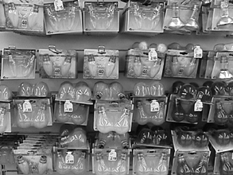 |
| Bedroom |  | 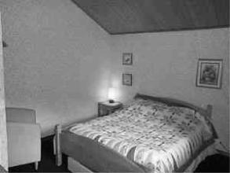 | 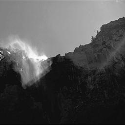 | 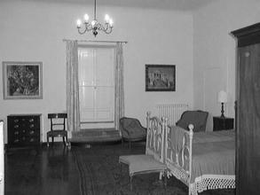 |
| LivingRoom |  |  |  |  |
| Office | 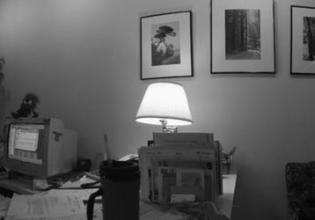 | 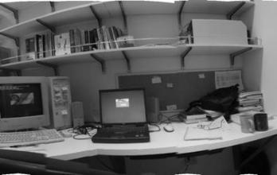 |  |  |
| Industrial |  |  |  |  |
| Suburb | 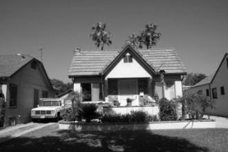 |  |  |  |
| InsideCity |  |  |  |  |
| TallBuilding |  |  |  | 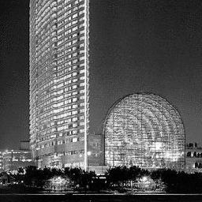 |
| Street |  |  | 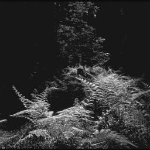 |  |
| Highway |  |  |  |  |
| OpenCountry | 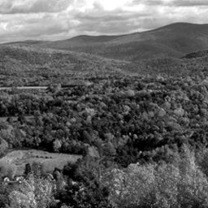 |  | 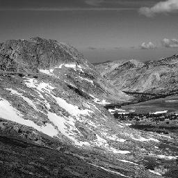 |  |
| Coast |  | 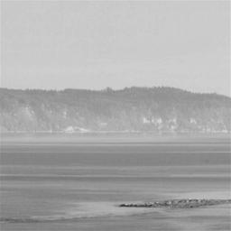 |  |  |
| Mountain |  | 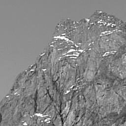 |  |  |
| Forest | 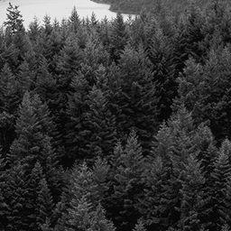 |  |  |  |


<center>
<h1>Project 3 results visualization</h1>


<br>
Accuracy (mean of diagonal of confusion matrix) is 0.068
<p>

<table border=0 cellpadding=4 cellspacing=1>
<tr>
<th>Category name</th>
<th>Accuracy</th>
<th colspan=2>Sample training images</th>
<th colspan=2>Sample true positives</th>
<th colspan=2>False positives with true label</th>
<th colspan=2>False negatives with wrong predicted label</th>
</tr>
<tr>
<td>Kitchen</td>
<td>0.070</td>
<td bgcolor=LightBlue></td>
<td bgcolor=LightBlue></td>
<td bgcolor=LightGreen></td>
<td bgcolor=LightGreen></td>
<td bgcolor=LightCoral><br><small>InsideCity</small></td>
<td bgcolor=LightCoral><br><small>Store</small></td>
<td bgcolor=#FFBB55><br><small>TallBuilding</small></td>
<td bgcolor=#FFBB55><br><small>LivingRoom</small></td>
</tr>
<tr>
<td>Store</td>
<td>0.090</td>
<td bgcolor=LightBlue></td>
<td bgcolor=LightBlue></td>
<td bgcolor=LightGreen></td>
<td bgcolor=LightGreen></td>
<td bgcolor=LightCoral><br><small>Coast</small></td>
<td bgcolor=LightCoral><br><small>LivingRoom</small></td>
<td bgcolor=#FFBB55><br><small>OpenCountry</small></td>
<td bgcolor=#FFBB55><br><small>Highway</small></td>
</tr>
<tr>
<td>Bedroom</td>
<td>0.060</td>
<td bgcolor=LightBlue></td>
<td bgcolor=LightBlue></td>
<td bgcolor=LightGreen></td>
<td bgcolor=LightGreen></td>
<td bgcolor=LightCoral><br><small>Kitchen</small></td>
<td bgcolor=LightCoral><br><small>Mountain</small></td>
<td bgcolor=#FFBB55><br><small>Coast</small></td>
<td bgcolor=#FFBB55><br><small>Industrial</small></td>
</tr>
<tr>
<td>LivingRoom</td>
<td>0.050</td>
<td bgcolor=LightBlue></td>
<td bgcolor=LightBlue></td>
<td bgcolor=LightGreen></td>
<td bgcolor=LightGreen></td>
<td bgcolor=LightCoral><br><small>Office</small></td>
<td bgcolor=LightCoral><br><small>Office</small></td>
<td bgcolor=#FFBB55><br><small>Kitchen</small></td>
<td bgcolor=#FFBB55><br><small>Mountain</small></td>
</tr>
<tr>
<td>Office</td>
<td>0.080</td>
<td bgcolor=LightBlue></td>
<td bgcolor=LightBlue></td>
<td bgcolor=LightGreen></td>
<td bgcolor=LightGreen></td>
<td bgcolor=LightCoral><br><small>Street</small></td>
<td bgcolor=LightCoral><br><small>TallBuilding</small></td>
<td bgcolor=#FFBB55><br><small>Coast</small></td>
<td bgcolor=#FFBB55><br><small>Kitchen</small></td>
</tr>
<tr>
<td>Industrial</td>
<td>0.100</td>
<td bgcolor=LightBlue></td>
<td bgcolor=LightBlue></td>
<td bgcolor=LightGreen></td>
<td bgcolor=LightGreen></td>
<td bgcolor=LightCoral><br><small>Street</small></td>
<td bgcolor=LightCoral><br><small>Store</small></td>
<td bgcolor=#FFBB55><br><small>Highway</small></td>
<td bgcolor=#FFBB55><br><small>Store</small></td>
</tr>
<tr>
<td>Suburb</td>
<td>0.030</td>
<td bgcolor=LightBlue></td>
<td bgcolor=LightBlue></td>
<td bgcolor=LightGreen></td>
<td bgcolor=LightGreen></td>
<td bgcolor=LightCoral><br><small>Bedroom</small></td>
<td bgcolor=LightCoral><br><small>Forest</small></td>
<td bgcolor=#FFBB55><br><small>Forest</small></td>
<td bgcolor=#FFBB55><br><small>Highway</small></td>
</tr>
<tr>
<td>InsideCity</td>
<td>0.050</td>
<td bgcolor=LightBlue></td>
<td bgcolor=LightBlue></td>
<td bgcolor=LightGreen></td>
<td bgcolor=LightGreen></td>
<td bgcolor=LightCoral><br><small>Coast</small></td>
<td bgcolor=LightCoral><br><small>Store</small></td>
<td bgcolor=#FFBB55><br><small>Forest</small></td>
<td bgcolor=#FFBB55><br><small>Bedroom</small></td>
</tr>
<tr>
<td>TallBuilding</td>
<td>0.050</td>
<td bgcolor=LightBlue></td>
<td bgcolor=LightBlue></td>
<td bgcolor=LightGreen></td>
<td bgcolor=LightGreen></td>
<td bgcolor=LightCoral><br><small>Suburb</small></td>
<td bgcolor=LightCoral><br><small>InsideCity</small></td>
<td bgcolor=#FFBB55><br><small>Store</small></td>
<td bgcolor=#FFBB55><br><small>Suburb</small></td>
</tr>
<tr>
<td>Street</td>
<td>0.050</td>
<td bgcolor=LightBlue></td>
<td bgcolor=LightBlue></td>
<td bgcolor=LightGreen></td>
<td bgcolor=LightGreen></td>
<td bgcolor=LightCoral><br><small>Highway</small></td>
<td bgcolor=LightCoral><br><small>Bedroom</small></td>
<td bgcolor=#FFBB55><br><small>LivingRoom</small></td>
<td bgcolor=#FFBB55><br><small>TallBuilding</small></td>
</tr>
<tr>
<td>Highway</td>
<td>0.040</td>
<td bgcolor=LightBlue></td>
<td bgcolor=LightBlue></td>
<td bgcolor=LightGreen></td>
<td bgcolor=LightGreen></td>
<td bgcolor=LightCoral><br><small>TallBuilding</small></td>
<td bgcolor=LightCoral><br><small>Kitchen</small></td>
<td bgcolor=#FFBB55><br><small>OpenCountry</small></td>
<td bgcolor=#FFBB55><br><small>Coast</small></td>
</tr>
<tr>
<td>OpenCountry</td>
<td>0.100</td>
<td bgcolor=LightBlue></td>
<td bgcolor=LightBlue></td>
<td bgcolor=LightGreen></td>
<td bgcolor=LightGreen></td>
<td bgcolor=LightCoral><br><small>Forest</small></td>
<td bgcolor=LightCoral><br><small>Bedroom</small></td>
<td bgcolor=#FFBB55><br><small>Highway</small></td>
<td bgcolor=#FFBB55><br><small>Street</small></td>
</tr>
<tr>
<td>Coast</td>
<td>0.080</td>
<td bgcolor=LightBlue></td>
<td bgcolor=LightBlue></td>
<td bgcolor=LightGreen></td>
<td bgcolor=LightGreen></td>
<td bgcolor=LightCoral><br><small>Bedroom</small></td>
<td bgcolor=LightCoral><br><small>TallBuilding</small></td>
<td bgcolor=#FFBB55><br><small>Street</small></td>
<td bgcolor=#FFBB55><br><small>Street</small></td>
</tr>
<tr>
<td>Mountain</td>
<td>0.120</td>
<td bgcolor=LightBlue></td>
<td bgcolor=LightBlue></td>
<td bgcolor=LightGreen></td>
<td bgcolor=LightGreen></td>
<td bgcolor=LightCoral><br><small>Street</small></td>
<td bgcolor=LightCoral><br><small>Coast</small></td>
<td bgcolor=#FFBB55><br><small>Bedroom</small></td>
<td bgcolor=#FFBB55><br><small>Street</small></td>
</tr>
<tr>
<td>Forest</td>
<td>0.050</td>
<td bgcolor=LightBlue></td>
<td bgcolor=LightBlue></td>
<td bgcolor=LightGreen></td>
<td bgcolor=LightGreen></td>
<td bgcolor=LightCoral><br><small>Bedroom</small></td>
<td bgcolor=LightCoral><br><small>Coast</small></td>
<td bgcolor=#FFBB55><br><small>Coast</small></td>
<td bgcolor=#FFBB55><br><small>OpenCountry</small></td>
</tr>
<tr>
<th>Category name</th>
<th>Accuracy</th>
<th colspan=2>Sample training images</th>
<th colspan=2>Sample true positives</th>
<th colspan=2>False positives with true label</th>
<th colspan=2>False negatives with wrong predicted label</th>
</tr>
</table>
</center>


